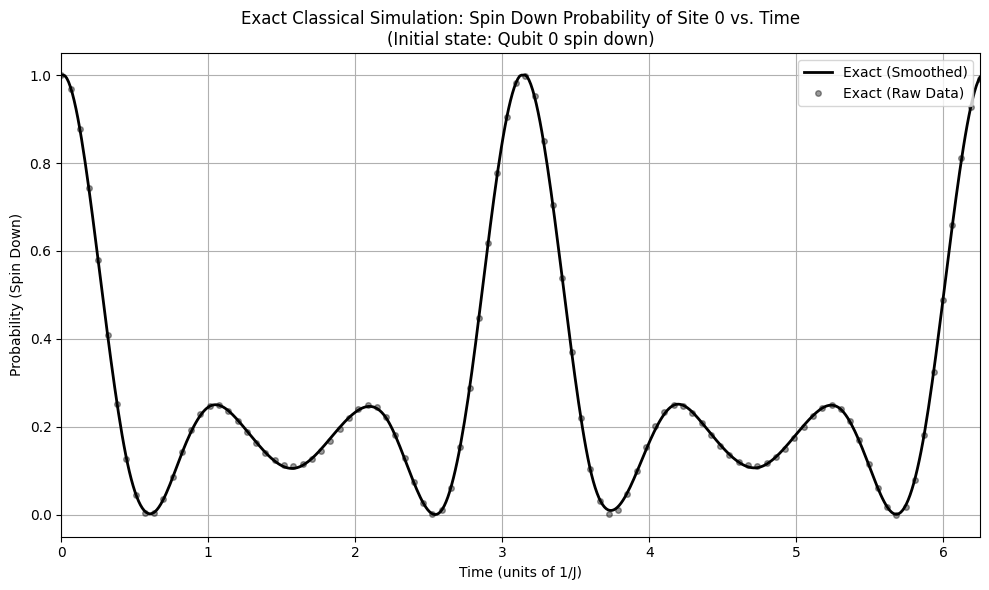
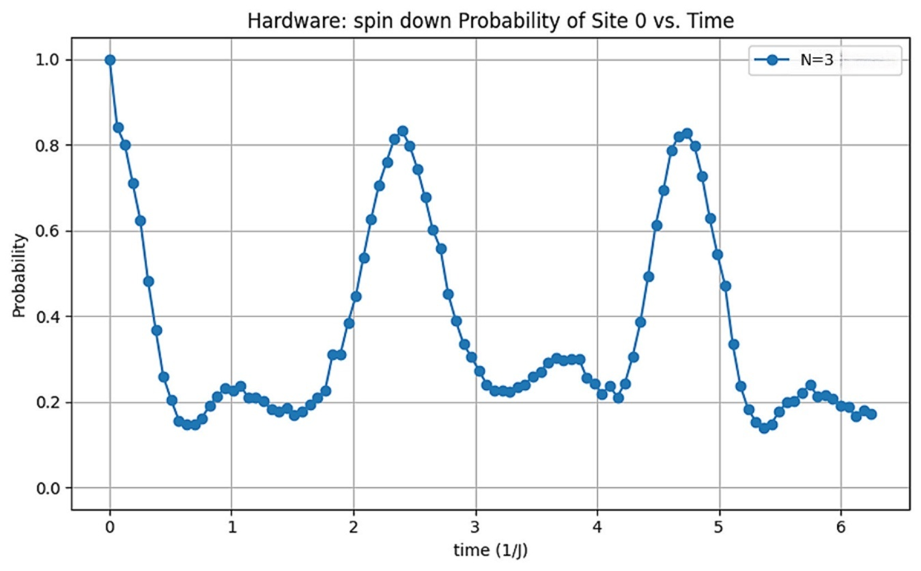
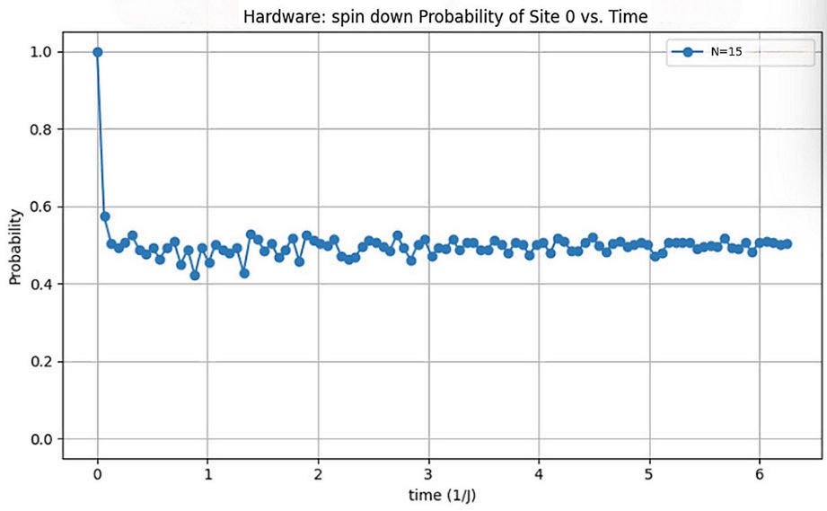

# Quantum-Heisenberg-Simulation
Numerical simulation of spin dynamics in hexagonal lattices using Python and Qiskit.

## 📌 Project Overview
This project is a comparative study of the dynamics of the **spin-½ XXX Heisenberg model** on a single hexagon extracted from a honeycomb lattice. It utilizes both classical numerical methods and quantum computing approaches. We track the probability of finding a chosen lattice site in a spin-down state as a function of time, comparing results from:
* **Exact Classical Computation** (SciPy)
* **Aer Quantum Simulator** (Noise-free)
* **IBM Quantum Hardware** (Noisy environment)

## 🚀 Key Features
* **Lattice Modeling:** Hexagonal topology generated via `NetworkX`.
* **Exact Simulation:** Time evolution using `SciPy` matrix exponentiation.
* **Quantum-Ready:** Built-in Trotterization logic (Suzuki–Trotter decomposition) using `Qiskit`.
* **Hardware Validation:** Comparative analysis of noise impact on real quantum devices.

## 📊 Results & Analysis

### 1. System Configuration
The simulation begins by defining the hexagonal interaction edges for a 6-qubit system.

*Figure 1: Hexagonal lattice topology (N=6).*

### 2. Theoretical Baseline (Exact vs. Simulator)
We established an ideal benchmark using classical exact diagonalization and compared it with the noise-free Aer simulator.
| Exact Classical Simulation | Aer Simulator (15 Steps) |
| :---: | :---: |
|  |  |
*Figure 2 & 3: Comparison between ideal classical theory and noise-free quantum simulation.*

**Analysis:** By observing the wave behavior, we extrapolate the site’s spin state at given time intervals. The Aer simulator (Figure 3) shows excellent alignment with the exact results as Trotter steps increase, validating the algorithmic logic in an ideal environment.

### 3. Hardware Execution & Noise Analysis
To test real-world viability, the circuit was executed on IBM Quantum hardware.
| Hardware Execution (Low Depth) | Hardware Execution (High Depth) |
| :---: | :---: |
|  |  |
*Figure 4 & 5: Impact of circuit depth on real quantum hardware performance.*

**Key Findings:** * **Trotter Accuracy vs. Noise:** While increasing Trotter steps improves theoretical accuracy, it also increases circuit depth. 
* **Decoherence:** At higher steps (N=15, Figure 5), the deeper hardware circuit suffers significant decoherence and gate errors, distorting the waveform compared to the shallow circuit (N=3, Figure 4).
* **Hardware Optimization:** These insights help developers optimize native gate primitives, such as implementing direct R_XX/R_YY/R_ZZ pulses to reduce CNOT counts and minimize error.

## 🛠️ Tech Stack
* **Language:** Python 3.x
* **Quantum Framework:** Qiskit
* **Numerical Libraries:** NumPy, SciPy
* **Network & Viz:** NetworkX, Matplotlib

## 📜 References
[1] Optimized Gate Decompositions for IBM Quantum Hardware.
