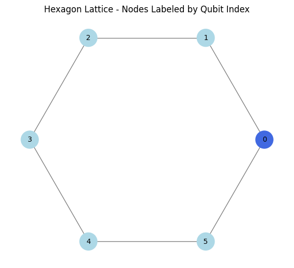
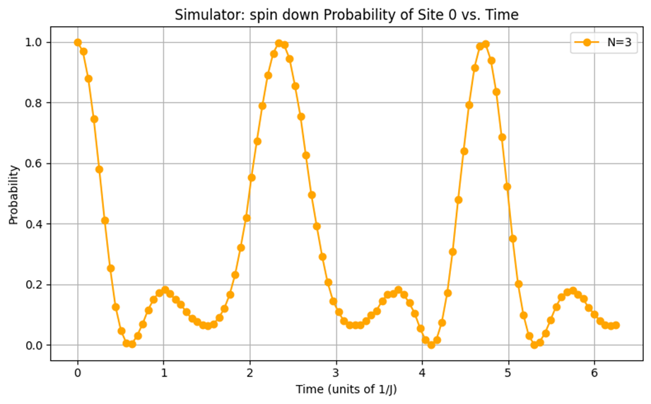
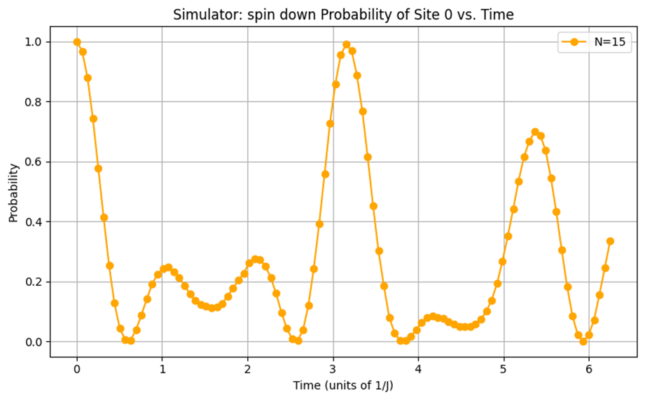

# Quantum-Heisenberg-Simulation
Numerical simulation of spin dynamics in hexagonal lattices using Python and Qiskit.
# Quantum Dynamics: Heisenberg Model Simulation
This project is a comparative study of the dynamics of the spin-½ XXX Heisenberg model on a single hexagon extracted from a honeycomb lattice by using classical and quantum computing methods. We simulate the spin dynamics and track the probability of finding a chosen lattice site in a spin down state as a function of time on both the Aer simulator and IBM’s noisy quantum hardware using Suzuki –Trotter decomposition. This is then compared with the exact computation. The results show behavior similar to the exact calculations. However, with more trotter steps, the circuit depth increases, and hardware errors begin to distort the outcomes. Nevertheless, the simulator remains closely aligned with the classical results as the trotter steps increase. This highlights the limitations caused by noisy hardware yet signals strong potential for quantum devices once they are fully developed. 

## 🚀 Key Features
- **Lattice Modeling:** Hexagonal topology generated via NetworkX.
- **Exact Simulation:** Time evolution using SciPy's matrix exponentiation.
- **Quantum-Ready:** Built-in Trotterization logic using Qiskit.
- **Data Visualization:** Probability distribution plots for spin states.

## 📊 Sample Results

*Figure 1: lattice configeration.*

*figure 2: a graph of Classically computed spin down probability of site 0 as a function of time.*

*Analysis: By observing the wave behavior in figure 2 we can extrapolate the site’s spin state at a given time. when t=0, 3.25 and 6 (1∕J) the probability of a spin down is 100% in contrast when the probability is 0% that means that the site is in a spin up state ,furthermore the intervals between 0% and 100% exist in a superposition of |1⟩ and |0⟩.*

*Figure 3: a graph of simulated spin down probability of site 0 as a function of time at N=3 using an Aer simulator.*

*Figure 4: a graph of simulated spin down probability of site 0 as a function of time at N=3 using a quantum computer.*

*Figure 5: a graph of simulated spin down probability of site 0 as a function of time at N=15 using an Aer simulator.*

*Figure 6: a graph of simulated spin down probability of site 0 as a function of time at N=15 using a quantum computer.*

*Analysis: Trotter error builds up, causing its oscillations to drift out of phase when compared with the exact curve. Examining the shallower circuits at N=3 (Figure 3) shows very good agreement between the simulator and the same N=3 circuit on real hardware (Figure 4) given that it captures the correct peak and trough locations despite device noise. By contrast, at N=15(Figure 6) the deeper hardware circuit suffers significant decoherence and gate errors, which severely distort the waveform. This comparison highlights that the noise free Aer simulator can push to higher Trotter order without degradation, whereas the real-world quantum hardware is constrained by a tradeoff between circuit depth —Trotter accuracy— and noise resilience.
this honeycomb Heisenberg simulation not only probes many-body physics but also deliver valuable feedback to hardware developers. For example, the textbook decomposition:
R_XX (θ)⟶CNOT-R_ZX (π/2)-CNOT
on IBM devices requires two full-strength cross resonance R_ZX (π/2) pulses plus single qubit rotations. Instead, one can directly implement R_XX (θ), R_YY (θ) and R_ZZ (θ) issuing a single partial cross resonance pulse R_ZX (θ)  sandwiched by calibrated single qubit gates[1]. This shortcut halves the two qubit pulse count, trims average rotation angles, and measurably reduces error. It’s precisely this kind of insight—born from user experiments on real circuits—that helps hardware developers optimize native gate primitives and push toward ever more reliable quantum processors.*

## 🛠️ Tech Stack
- **Language:** Python 3.x
- **Libraries:** NumPy, SciPy, Qiskit, Matplotlib, NetworkX
